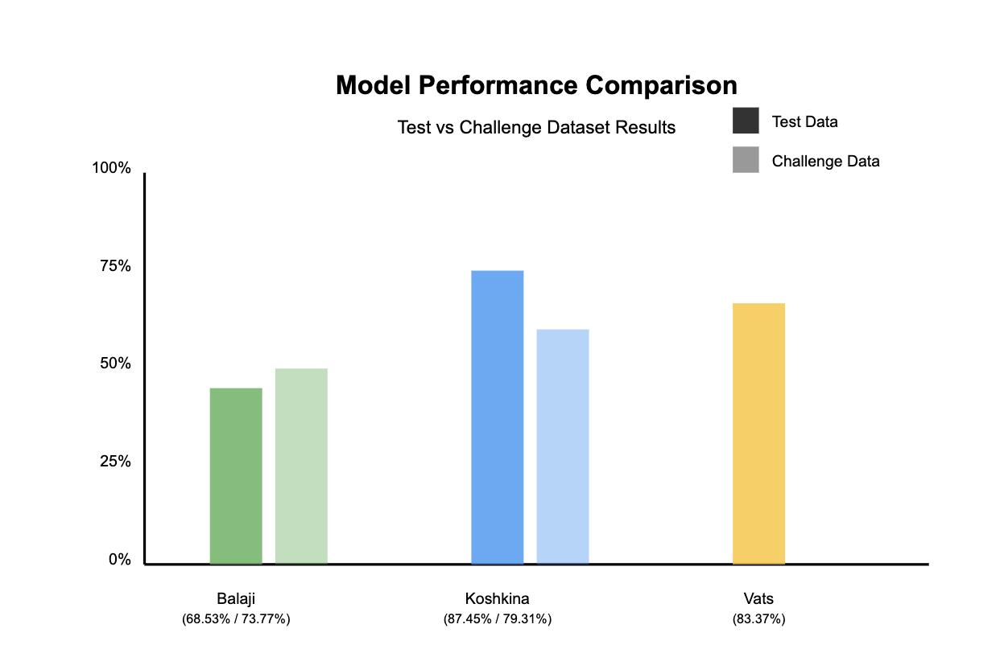

# COSC 419 Project Progress Journal
Project: Jersey Number Recognition System
Group 1

## Executive Summary
This progress journal documents the development of our jersey number recognition system, tracking technical decisions, research findings, and implementation strategies across team meetings.

## Meeting Record: January 23, 2024
### Meeting Details
- **Date**: January 23, 2024
- **Time**: Post-class session
- **Location**: In-person
- **Attendees**: Jeremy, Muskaan, Jared, Aadil, Mahmoud

### Technical Discussion
1. Project Requirements Analysis
   - Identification of core technical challenges in jersey number recognition
   - Review of current state-of-art methodologies

2. Research Assignment Distribution
   - Each team member assigned to research 2-3 peer-reviewed academic papers
   - Focus on diverse methodologies including CNN, Transformers, and hybrid approaches

### Research Assignments & Individual Focus

#### Muskaan's Research Focus
- Jersey Number Recognition using Keyframe Identification (Balaji et al.)
- A General Framework for Jersey Number Recognition (Koshkina)
- Ice Hockey Player Identification via Transformers (Vats et al.)

#### Jeremy's Research Focus
- JEDE: Universal Jersey Number Detector
- Soccer Jersey Number Recognition Using CNNs

#### Aadil's Research Focus
- Pose-Guided R-CNN for Jersey Number Recognition
- Generalized Jersey Number Recognition Using Multi-Task Learning

#### Colin's Research Focus (Joined Team in Feb)
- Scaling Vision with Sparse Mixture of Experts
- Retrieval Augmented Classification

#### Jared's Additional Tasks
- Pipeline replication implementation
- Code architecture review

#### Mahmoud's Research Focus
- Transformer architecture evaluation
- Model comparison analysis

### Action Items
| Task | Assignee | Due Date | Status |
|------|----------|----------|---------|
| Academic paper research | All members | Jan 27, 2024 | Completed |
| Pipeline replication | Jared | Jan 27, 2024 | Completed |

## Meeting Record: January 27, 2024
### Meeting Details
- **Date**: January 27, 2024
- **Time**: 11:00 AM
- **Location**: Discord Call
- **Attendees**: All team members

### Technical Discussion
1. Literature Review Analysis
   - Presentation of findings from academic papers
   - Discussion of implementation feasibility
   - Comparison of different architectural approaches

2. Technical Assessment
   - Evaluation of model architectures
   - Dataset requirements analysis
   - Implementation strategy planning

#### Muskaan's Research Summary
Papers reviewed:
1. Jersey Number Recognition using Keyframe Identification (Balaji et al.)
   - KfId module improved accuracy by 38%
   - 87% frame reduction efficiency
   - 68.53% test accuracy, 73.77% challenge accuracy

2. A General Framework for Jersey Number Recognition (Koshkina)
   - PARSeq adaptation achieved 87.45% accuracy
   - Cross-sport applicability demonstrated
   - Pose detection integration successful

3. Ice Hockey Player Identification via Transformers (Vats)
   - Transformer architecture with weak supervision
   - 83.37% accuracy on hockey dataset
   - Player shift integration improved accuracy by 6%

#### Colin's Research Summary
Papers reviewed:
1. Scaling Vision with Sparse Mixture of Experts
   - 15B parameter model achieving 90.35% accuracy
   - Half compute requirement at inference time
   - Sparse activation pattern benefits

2. Retrieval Augmented Classification
   - Long-tail classification improvements
   - 14.5% improvement on Places365-LT
   - Effective use of training set as external memory

#### Aadil's Research Summary
Papers reviewed:
1. Pose-Guided R-CNN
   - 94.09% digit-level accuracy
   - Novel framework for body part integration
   - Effective bounding box optimization

2. Multi-Task Learning with Orientation
   - Top-1 accuracy of 64.07%
   - Multi-sport dataset compilation
   - Body rotation angle consideration

#### Jeremy's Research Summary
Papers reviewed:
1. JEDE Framework
   - Comprehensive player identification
   - Novel data augmentation strategies
   - End-to-end detection improvements

2. Soccer Jersey Recognition with CNN
   - 0.83 recognition rate improvement
   - Novel deep learning architecture
   - Effective dataset development strategy

#### Mahmoud's Research Summary
Focus on transformer architecture evaluation:
- Temporal modeling effectiveness
- Cross-model performance comparison
- Integration potential analysis

#### Jared's Implementation Analysis
- Pipeline replication findings
- Architecture optimization opportunities
- Integration challenge identification

### Action Items
| Task | Assignee | Due Date | Status |
|------|----------|----------|---------|
| Download Dataset | All members | Feb 13, 2024 | Completed |
| Architecture analysis | Team assignments pending | Feb 13, 2024 | In Progress |

## Meeting Record: February 13, 2024
### Meeting Details
- **Date**: February 13, 2024
- **Location**: In-person
- **Attendees**: All previous members + Colin (new member)

### Technical Discussion
Model Testing Assignments:

1. ResNet Research Team (Muskaan, Jeremy):
   - Feature extraction optimization
   - Integration strategy development

2. Transformer Architecture Team (Aadil, Mahmoud):
   - Vision Transformer adaptation
   - Attention mechanism optimization

3. CNN Architecture Team (Jared, Colin):
   - Architecture optimization
   - Feature detection enhancement

### Action Items
| Task | Assignee | Due Date | Status |
|------|----------|----------|---------|
| ResNet analysis | Muskaan, Jeremy | TBD | In Progress |
| Transformer analysis | Aadil, Mahmoud | TBD | In Progress |
| CNN anaylsis | Jared, Colin | TBD | In Progress |

## Technical Progress Summary
1. Research Phase:
   - Completed literature review of current methodologies
   - Identified key technical challenges
   - Established baseline performance metrics

2. Implementation Strategy:
   - Divided technical work into specialized teams
   - Established cross-team collaboration framework
   - Defined success metrics and evaluation criteria

## Reading Break Progress Check (February 19-23, 2024)

### Team Progress Updates

#### ResNet Team (Muskaan, Jeremy):
While the theoretical understanding of the original ResNet paper was straightforward, practical implementation has presented several challenges:
- Encountered multiple errors during result replication attempts
- Making steady progress in understanding ResNet's value for feature extraction
- Learning importance of residual connections in deep networks
- Working through implementation debugging process

#### Transformer Team Update (Aadil, Mahmoud):
- 
#### CNN / Data Pre-Processing and Augmentation Team Update (Colin, Jared):
**Colin:**
- `experimented` with data augmentation by creating a `DataAugmentation` class for which we can perform certain `LegalTransformations`. This will help us increase the robustness of our models by training them on diverse scenarios
- `created` a `working_script.ipynb` notebook with a case study on sample data augmentation use cases
- `created` an `ImageEnhancement` class that we can leverage to post-process our image in our favour when we feed it to our model
- `created` a `DataPreProcessing` class that facilitates tracklet iteration

**Jared:**
- `created` a custom CNN model
- `tested` a tracklet iterator and the state of the art centroid CNN (86% accuracy)
- `enhanced` logging in existing state of the art CNNs so that we can understand what is going on in the background (previously no logging whatsoever)

## Proposal Meeting Check and Catch Up (March 1, 2025)

#### Paper review

- Went through the paper put together and finalized each section
- Entered in Mahmoud's experimental design and evaluation metrics
- Reformatted paper

#### Steps Moving Forward

- Mukaan & Jeremy will be working to implement a new ResNet model to enhance the number classification step.
- Jared & Colin will be working on data augmentation and implementing the new STR model enhanced with a Mixture of Experts and Retrieval Augmented Classification combination approach.
- Mahmoud & Aadil will be working on implementing ConvNet into the classification and monitoring the experiment setup an execution to ensure proper training, testing and evaluation is happening.
